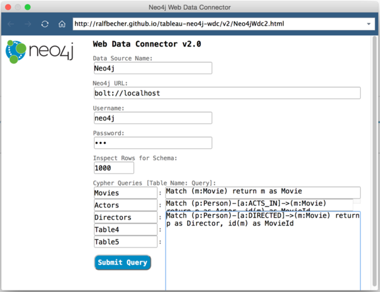
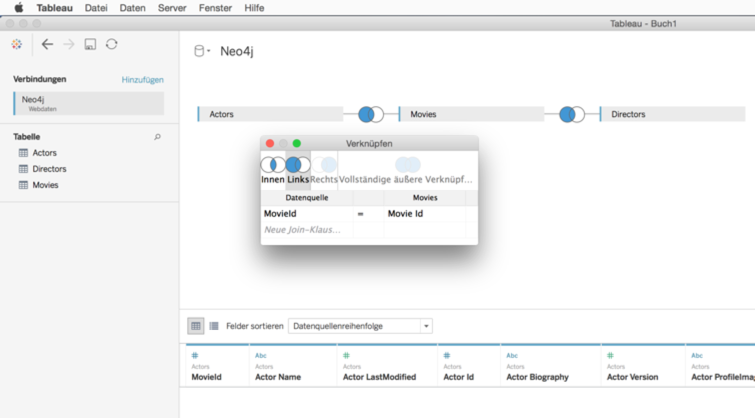
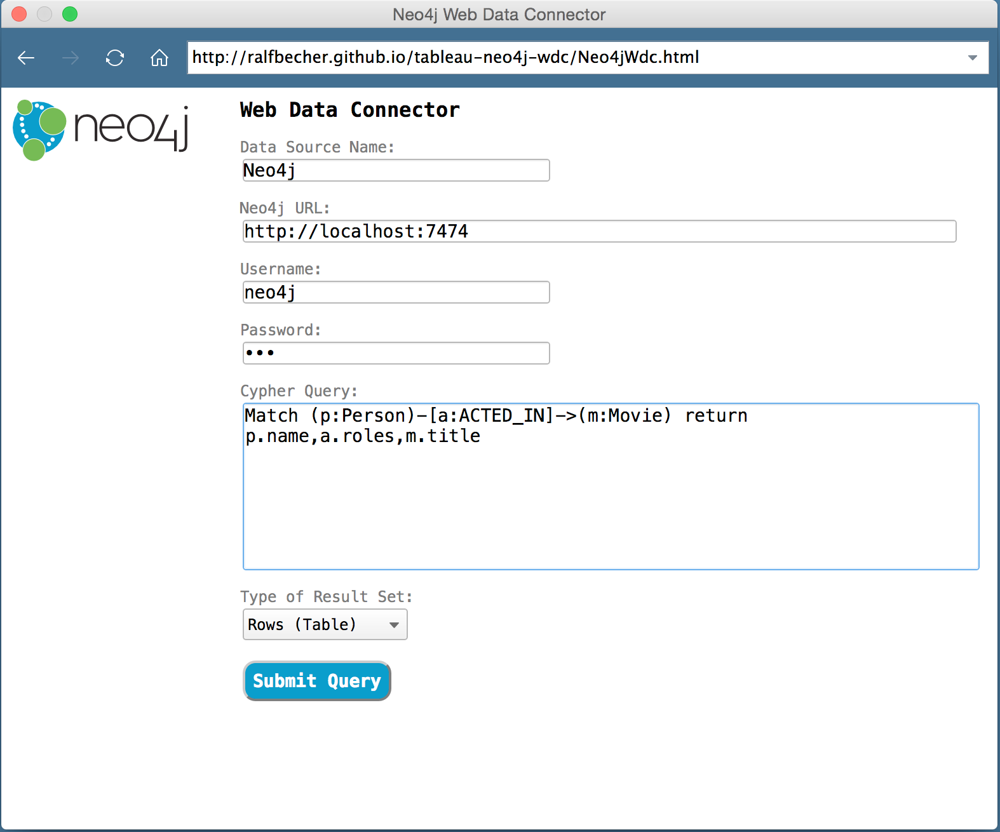

# Neo4j Web Data Connector v2.3

This Tableau WDC implements WDC v2.3.0 and can be used with Tableau v10.4 or later and Neo4j v3.0.4 or later:

[https://tableau.github.io/webdataconnector/docs/wdc_library_versions](https://tableau.github.io/webdataconnector/docs/wdc_library_versions)

For details on Tableau's Web Data Connector and the WDC SDK please visit:

[http://tableau.github.io/webdataconnector](http://tableau.github.io/webdataconnector)

The Neo4j WDC uses the Neo4j Driver for Javascript v1.7 which implements the [Bolt](https://en.wikipedia.org/wiki/Bolt_%28network_protocol%29) network protocol:

[https://github.com/neo4j/neo4j-javascript-driver](https://github.com/neo4j/neo4j-javascript-driver)

## Updates

### New in Version 2.3
* Neo4j [Temporal values](https://neo4j.com/docs/developer-manual/current/cypher/syntax/temporal/)
  * converts Neo4j Date and DateTime values to Tableau Date or DateTime
  * converts Neo4j Time values to Tableau Integer (seconds of the day)
  * doesn't convert Neo4j Duration values but creates separate columns for all parts (months, days, seconds, nanoseconds)
* Neo4j [Spatial values](https://neo4j.com/docs/developer-manual/current/cypher/syntax/spatial/)
  * converts Neo4j Point values to Tableau Geometry (GeoJSON)

## Usage

The Neo4j WDC v2.3 can be used online via hosted GitHub page. Here is the WDC URL you can copy to your Tableau client:

[http://ralfbecher.github.io/tableau-neo4j-wdc/v2.3/Neo4jWdc2.html](http://ralfbecher.github.io/tableau-neo4j-wdc/v2.3/Neo4jWdc2.html) (copy URL)



### Connector Parameters

1. **Data Source Name**: the name for the data source in the Tableau Workbook
2. **Neo4j URL**: URL to connect a Neo4j server, usually ```bolt://<server>``` when default Bolt port or ```bolt://<server>:<port>```
3. **Username/Password**: authentication credentials
4. **Inspect Rows for Schema**: number of sample rows (default: 1000) to inspect JSON result set (can contain complex objects) 
from Cypher queries for used properties, important to build the table schema with columns for Tableau; set to 1 when first 
row includes all properties
5. **Cypher Queries**: a list to add up to 5 Cypher queries for execution; use a table name per query in left column; 
tables can then be joined in Tableau data wizard later



## Previous Version

The Neo4j WDC v1.0 can still be used via new URL:

[http://ralfbecher.github.io/tableau-neo4j-wdc/v1/Neo4jWdc.html](http://ralfbecher.github.io/tableau-neo4j-wdc/v1/Neo4jWdc.html)



## Author

**Ralf Becher**

+ [irregular.bi](http://irregular.bi)
* [twitter/irregularbi](http://twitter.com/irregularbi)
* [github.com/ralfbecher](http://github.com/ralfbecher)

## License

Copyright © 2016 Ralf Becher

Released under the MIT license.

***